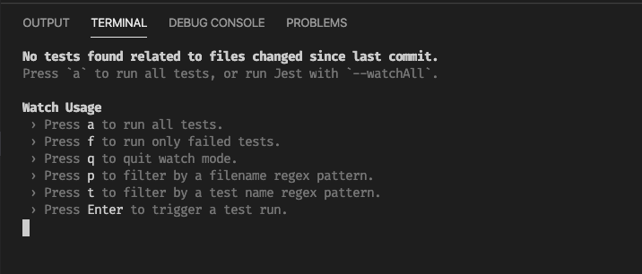
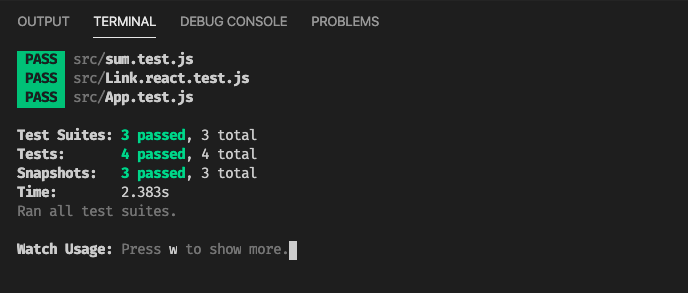
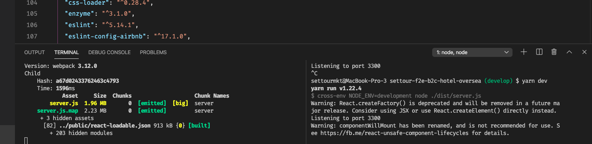
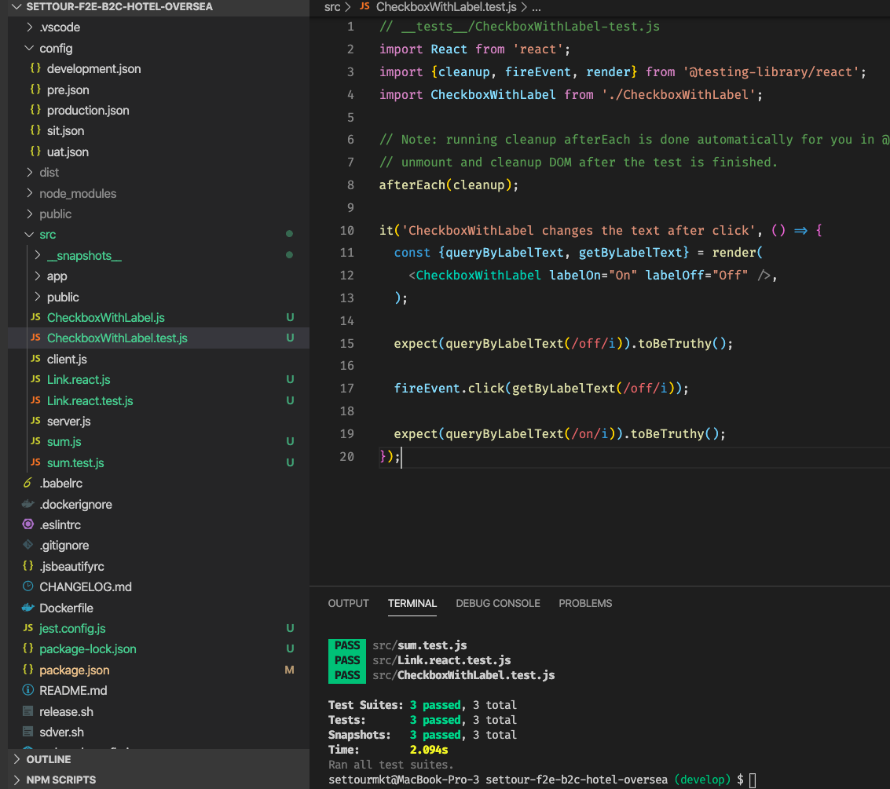

附上參考文件 操作流程 20~25 mins

https://jestjs.io/docs/en/getting-started

https://github.com/facebook/jest/issues/8155

https://github.com/facebook/jest/issues/8230

### 我的作法 ：
* 刪除 node_modules
* 刪除 yarn.lock
* 修改 package.json
* 重新安裝
* 新增 jest.config.js
* 新增測試文件
* 測試

<br />


新增
```
"resolutions": {"babel-jest": "23.6.0"}
```

<br />

新增
```
  "scripts": {
      ...
    "test": "jest"
  },
```

<br />

重新安裝 3~5 mins
```
npm install
yarn install
```

<br />

在根目錄 （src上一層）
新增
jest.config.js
```
module.exports = {
    transform: {
      '^.+\\.[jt]sx?$': require.resolve('babel-jest')
    }
  };
```

<br />

新增  sum.js
src/sum.js
```
function sum(a, b) {
  return a + b;
}
module.exports = sum;
```

<br />

### 新增 sum.test.js
#### src/sum.test.js
```
const sum = require('./sum');

test('adds 1 + 2 to equal 3', () => {
  expect(sum(1, 2)).toBe(3);
});
``` 

<br />


## npm run test

此時你會看到 




按下 a 則會出現





<br /><br />
回頭測試 是否正常
yarn watch 
yarn dev





<br /><br />

Setup with Create React App
```
npm install react-test-renderer
```

---

# 文件中下面這行 " 不用 " 運行 , 會更新環境
請跳過
yarn add --dev jest babel-jest @babel/preset-env @babel/preset-react react-test-renderer

<br /> 

# Snapshot Testing
#### src/Link.react.js
```
// Link.react.js
import React from 'react';

const STATUS = {
  HOVERED: 'hovered',
  NORMAL: 'normal',
};

export default class Link extends React.Component {
  constructor(props) {
    super(props);

    this._onMouseEnter = this._onMouseEnter.bind(this);
    this._onMouseLeave = this._onMouseLeave.bind(this);

    this.state = {
      class: STATUS.NORMAL,
    };
  }

  _onMouseEnter() {
    this.setState({class: STATUS.HOVERED});
  }

  _onMouseLeave() {
    this.setState({class: STATUS.NORMAL});
  }

  render() {
    return (
      <a
        className={this.state.class}
        href={this.props.page || '#'}
        onMouseEnter={this._onMouseEnter}
        onMouseLeave={this._onMouseLeave}
      >
        {this.props.children}
      </a>
    );
  }
}
```

## Link.react.test.js
#### src/Link.react.js
```
// Link.react.test.js
import React from 'react';
import Link from '../Link.react';
import renderer from 'react-test-renderer';

test('Link changes the class when hovered', () => {
  const component = renderer.create(
    <Link page="http://www.facebook.com">Facebook</Link>,
  );
  let tree = component.toJSON();
  expect(tree).toMatchSnapshot();

  // manually trigger the callback
  tree.props.onMouseEnter();
  // re-rendering
  tree = component.toJSON();
  expect(tree).toMatchSnapshot();

  // manually trigger the callback
  tree.props.onMouseLeave();
  // re-rendering
  tree = component.toJSON();
  expect(tree).toMatchSnapshot();
});
```

---


# DOM Testing 

## 安裝react-testing-library
```
yarn add --dev @testing-library/react
```

<br />

#### src/CheckboxWithLabel.js
```
// CheckboxWithLabel.js

import React from 'react';

export default class CheckboxWithLabel extends React.Component {
  constructor(props) {
    super(props);
    this.state = {isChecked: false};

    // bind manually because React class components don't auto-bind
    // http://facebook.github.io/react/blog/2015/01/27/react-v0.13.0-beta-1.html#autobinding
    this.onChange = this.onChange.bind(this);
  }

  onChange() {
    this.setState({isChecked: !this.state.isChecked});
  }

  render() {
    return (
      <label>
        <input
          type="checkbox"
          checked={this.state.isChecked}
          onChange={this.onChange}
        />
        {this.state.isChecked ? this.props.labelOn : this.props.labelOff}
      </label>
    );
  }
}
```

<br />

#### src/CheckboxWithLabel-test.js
```
// __tests__/CheckboxWithLabel-test.js
import React from 'react';
import {cleanup, fireEvent, render} from '@testing-library/react';
import CheckboxWithLabel from '../CheckboxWithLabel';

// Note: running cleanup afterEach is done automatically for you in @testing-library/react@9.0.0 or higher
// unmount and cleanup DOM after the test is finished.
afterEach(cleanup);

it('CheckboxWithLabel changes the text after click', () => {
  const {queryByLabelText, getByLabelText} = render(
    <CheckboxWithLabel labelOn="On" labelOff="Off" />,
  );

  expect(queryByLabelText(/off/i)).toBeTruthy();

  fireEvent.click(getByLabelText(/off/i));

  expect(queryByLabelText(/on/i)).toBeTruthy();
});
```

最後
```
npm test 
```

如圖


