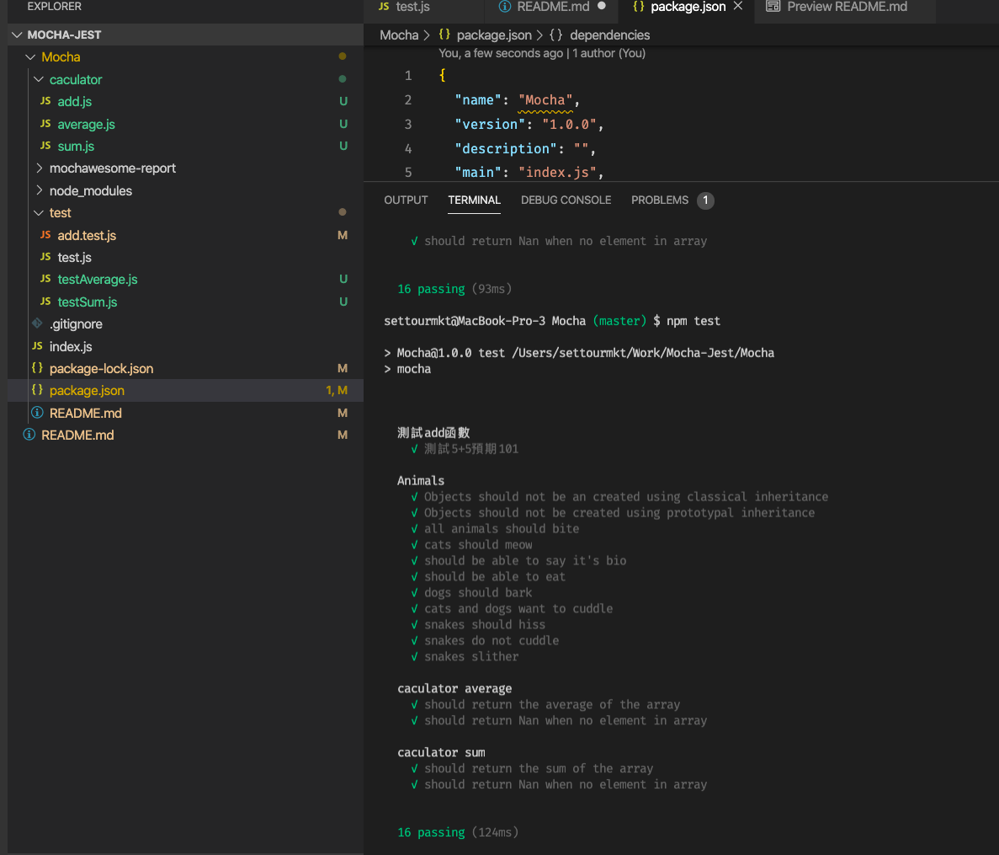

### Mocha-Jest

### 參考文章
## 基礎測試 (加法) 
https://medium.com/@bebebobohaha/%E5%89%8D%E7%AB%AF%E5%96%AE%E5%85%83%E6%B8%AC%E8%A9%A6%E5%85%A5%E9%96%80-mocha%E8%88%87chai-b3037b3a1de1

## 計算 (平均、陣列總和)
https://medium.com/cubemail88/node-js-%E7%94%A8-mocha-%E5%81%9A%E5%96%AE%E5%85%83%E6%B8%AC%E8%A9%A6-16dd9125e632

## 動物測試 (較複雜)
https://medium.com/@williamjoshualacey/unit-testing-with-mocha-fda6a6f360c6

# 安裝
```
npm install mocha -g            # mocha 執行檔要安裝在 global
npm install mocha --save
npm install should --save
```

# 使用方式
```
cd Mocha/
npm install
npm test
```
# 單頁測試
```
cd Mocha/
npm install
cd test/
mocha {{ your fileName }}
ex: mocha test
```
# 基礎

index.js
```
var expect = require('chai').expect;
const add = require('../index');
describe('測試add函數', () => {
  it('測試5+5預期10', () => {
    expect(add(5, 5)).to.be.equal(10);
  });
});
```

/test/test.js
```
const add = require('../index');
describe('測試add函數', () => {
    it('測試5+5預期10', () => {
        if(add(5,5) !== 10) {
            throw new Error('兩樹相加結果不為兩數和');
        }
    })
})
```
# 預覽畫面



## 產生報表
修改 package.json
```
"test": "mocha test/**/*.js --reporter mochawesome"
```
到 終端機 
npm test
